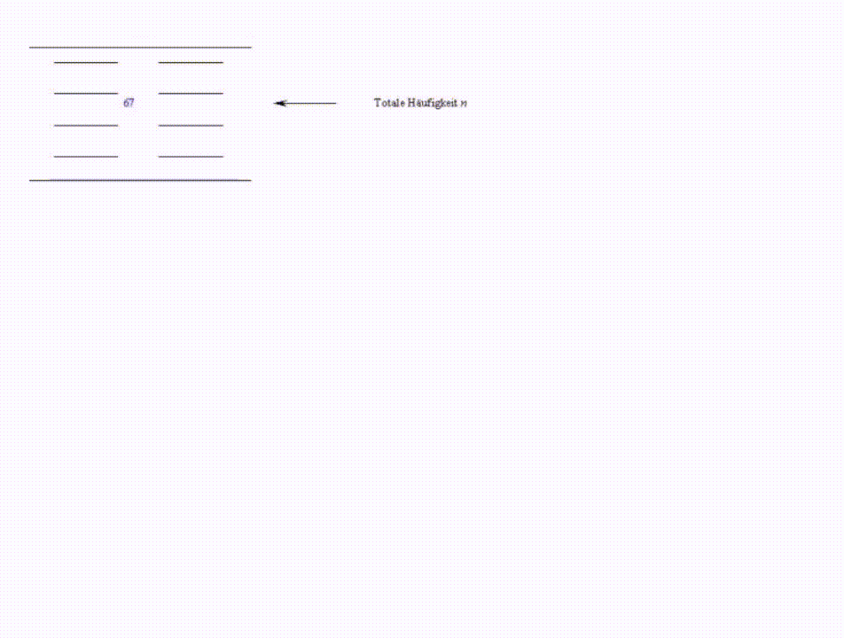

# Abh_Wkt

*Dependent probabilities* calculated in the probability and contingency fields. Presentation of the concepts of *multiplicative*, *additive* and *conditional* probability

$$p(B|A)$$

and above all *Total* probability within *Bayes' theorem*,  where

$$p(A|B)=\frac{p(B|A)⋅pA}{pB}.$$

Important works on the basis of probability theory can be found in Cardano ([1545](https://web.archive.org/web/20220201093634/http://www.filosofia.unimi.it/cardano/testi/operaomnia/vol_4_s_4.pdf)), Arnauld and Nicole ([1662](https://gallica.bnf.fr/ark:/12148/bpt6k574432.image)), de Moivre ([1711](https://doi.org/10.1098/rstl.1710.0018)), Bernoulli ([1713](https://www.e-rara.ch/zut/doi/10.3931/e-rara-9001)), Bayes and Price ([1763](http://www.jstor.org/stable/105741)) also Hacking ([1975](https://philpapers.org/rec/HACTEO-8)) or Hald ([1990](https://onlinelibrary.wiley.com/doi/book/10.1002/0471725161)).

A deeper insight into probability theory and probability calculation give e.g. Bortz and Schuster ([2010](https://doi.org/10.1007/978-3-642-12770-0)) or Harney ([2016](https://doi.org/10.1007/978-3-319-41644-1_2)).

## References

Arnauld, A., & Nicole, P. (1662). *La logique ou L’art de penser*. 1st ed. A Paris: Chez Charles Savreux, au pied de la Tour de Nostre Dame. [https://gallica.bnf.fr/ark:/12148/bpt6k574432.image](https://gallica.bnf.fr/ark:/12148/bpt6k574432.image)

Bortz, J., & Schuster, C. (2010). *Statistik Für Human- Und Sozialwissenschaftler: Limitierte Sonderausgabe*. 7th ed. Springer-Lehrbuch. Berlin, Heidelberg: Springer. [https://doi.org/10.1007/978-3-642-12770-0](https://doi.org/10.1007/978-3-642-12770-0)

Bayes, T., & Price, R. (1763). An Essay Towards Solving a Problem in the Doctrine of Chances. By the Late Rev. Mr. Bayes, f. R. S. Communicated by Mr. Price, in a Letter to John Canton, a. M. F. R. s. *Philosophical Transactions (1683-1775) 53*: 370–418. [http://www.jstor.org/stable/105741](http://www.jstor.org/stable/105741)

Bernoulli, J. (1713). *Ars conjectandi, opus posthumum. Accedit Tractatus de seriebus infinitis, et epistola gallicé scripta de ludo pilae reticularis*. Basileae: Impensis Thurnisiorum, Fratrum. [https://www.e-rara.ch/zut/doi/10.3931/e-rara-9001](https://www.e-rara.ch/zut/doi/10.3931/e-rara-9001)

Cardano, G. (1545). *HIERONYMI CARDANI, ARTIS MAGNÆ, SIVE DE REGVLIS ALGEBRAICIS, LIBER VNVS*. S. P. D: ANDREÆ OSIANDRO viro eruditiss. [https://web.archive.org/web/20220201093634/http://www.filosofia.unimi.it/cardano/testi/operaomnia/vol_4_s_4.pdf](https://web.archive.org/web/20220201093634/http://www.filosofia.unimi.it/cardano/testi/operaomnia/vol_4_s_4.pdf)

de Moivre, A. (1711). De mensura sortis, seu, de probabilitate eventuum in ludis a casu fortuito pendentibus. *Philosophical Transactions of the Royal Society of London 27* (329): 213–64. [https://doi.org/10.1098/rstl.1710.0018](https://doi.org/10.1098/rstl.1710.0018)

Hacking, I. (1975). *The Emergence of Probability: A Philosophical Study of Early Ideas About Probability, Induction and Statistical Inference*. Cambridge University Press. [https://philpapers.org/rec/HACTEO-8](https://philpapers.org/rec/HACTEO-8)

Hald, A. (1990). *History of Probability and Statistics and Their Applications before 1750*. New York: Wiley Series in Probability; Statistics, Wiley-Interscience. [https://onlinelibrary.wiley.com/doi/book/10.1002/0471725161](https://onlinelibrary.wiley.com/doi/book/10.1002/0471725161)

Harney, H. L. (2016). Bayes’ Theorem. In *Bayesian Inference: Data Evaluation and Decisions*, 11–25. Springer International Publishing. [https://doi.org/10.1007/978-3-319-41644-1_2](https://doi.org/10.1007/978-3-319-41644-1_2)
